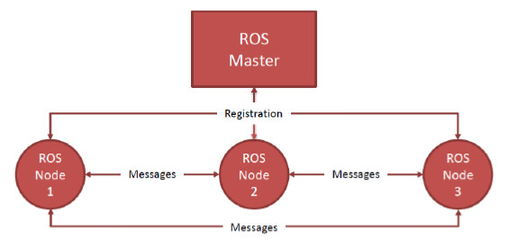
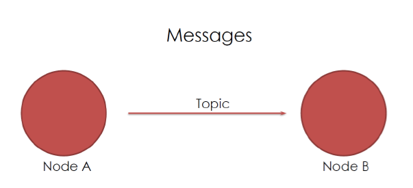
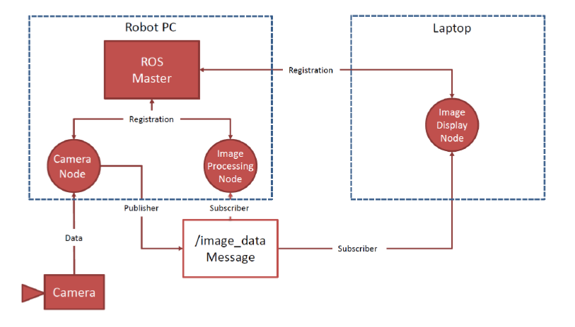
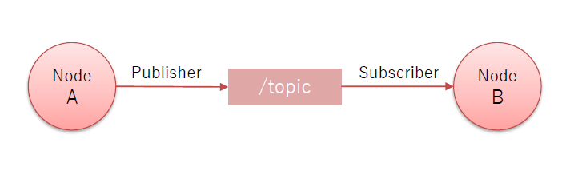
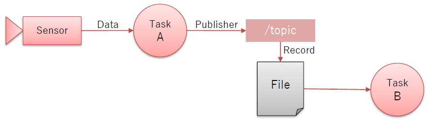
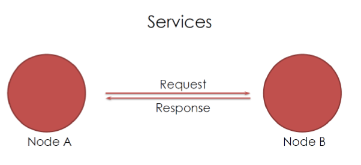
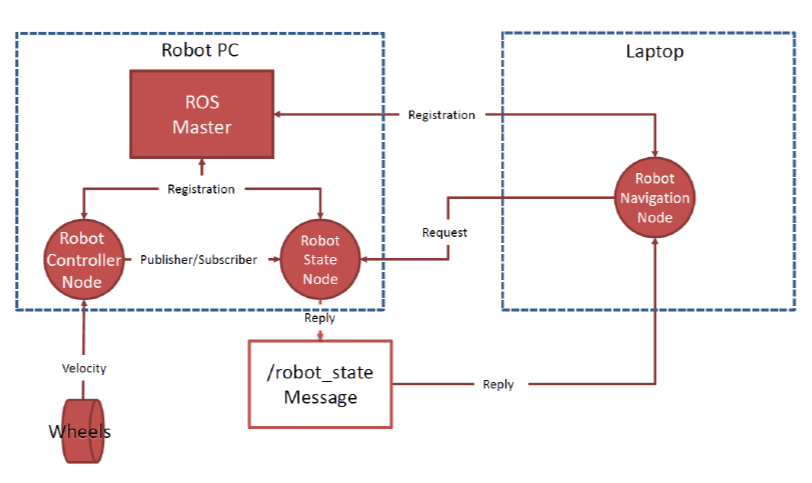
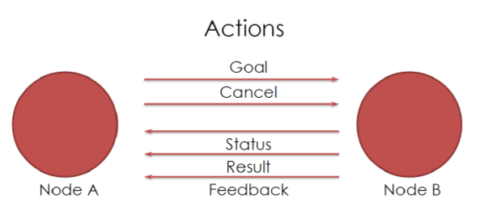
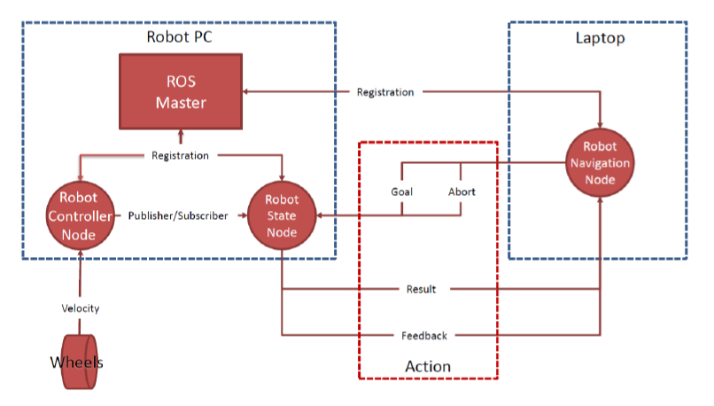
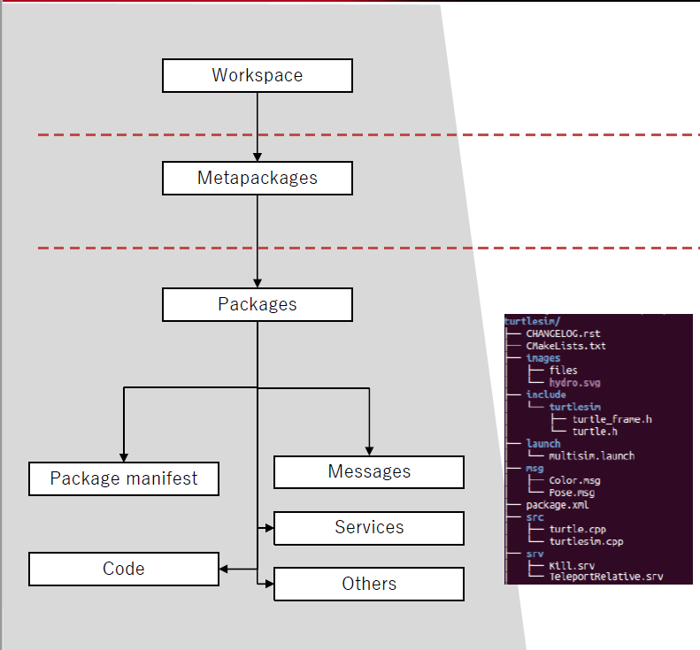

# ROS TUTORIAL
This tutorial will analyze the main features of ROS (Robot Operating System).

## Teoretical Background

### What is ROS ?
ROS (Robot Operating System), is an open source meta operating system for your robot. It provides the services you would expect from an operating system, including hardware abstraction low level device control implementation of commonly used functionality, message passing between processes, and package management It also provides tools and libraries for obtaining, building, writing, and running code across multiple computers.
### How ROS works ?
Ros is composed of several features the most important ones are : 
- Modular design
- Distributed computation
- Easy shareability and reusability
- Rapid testing

#### Modular design
The design of ROS is similar to the Client-Server architecture with :
- One **ROS Master Node** that correspond to the Server
- Severals **ROS  Node** that correspond to the Client

Therefore, ROS design correspond to a network where, **ROS Nodes**, communicate between themselves and with the *ROS Master*.
Notice that, **ROS Nodes**, in practice, corresponds to pieces of software (written in c++, python, etc.) that are written by programmers.

	

#### Distributed Computation
The reason why we can say that ROS has a distributed computation comes from the fact that a Robot can have serveral CPUs that are used to excute only some particular type of code (CPU for actuators, CPU for sensors etc.). Therefore, a "ROS application" is executed in a distributed way that means that some *ROS  Nodes* will be executed on a processor and others on another one. The only problem of design consists of how to handle the communication between the differents nodes. In particular, to do so, ROS uses a message mechanism system that relies on a message passing interface which has the following features :
- publish/subscribe anonymous message passing : messages are created with the publish-subscribe design pattern and they are also anonymous (don't know is the publisher from the subscriber) as well as asynchronous.

	
		

	

- recording and playback of messages : messages can be recorded and played back in order to debug the code.

	

In addition to that, ROS provides other important things :
- remote procedure calls : ROS uses a special kind of messages called **services** exchange messages between nodes.
- distributed parameter system : ROS provides a distributed key-value storage, accessible by every **node**  and that can be also use by them to share informations between different **nodes**.
- log system : a system for making logs with 5 different severity levels : DEBUG, INFO, WARN, ERROR, FATAL.

#### Easy Shareability And Reusability
Programs written in ROS are very easy to share and reuse. In fact, ROS packages provide stable implementations of many robotics algorithms and the ROS message passing system has become a standard for the most "Robotics Applications" out there.

#### Rapid Testing
Testing robots with ROS is very easy as well as very low in terms of costs due to the very sophisticated simulator that ROS provides. Debugging is also very easy as well because ROS allows to record and play back seonsor data and other kind of messages.

#### Summary
In summary,
- ROS provides standard OS like facilities such as hardware abstraction, low-level device control, implementation of commonly used functionalities, message passing between processes, and package management
- Sensors and actuators used in robotics have been adapted for use in ROS
– Arduino, Raspberry, Microsoft Kinect, Intel Realsense, …

### ROS Architecture
The architecture of ROS is composed of several things :
- Nodes : programs where computation is done. Each node controls different simple functions of the system and interaction between nodes is managed by the ROS Master Node
- The Master Node : this node stores information about the network. In particular, it is used by ROS Nodes to register themselves on startup and find information about other nodes. Notice that after the registration of a ROS Node to the master peer-to-peer communication between ROS Nodes is established.
- Messages : informations that nodes sends to others. Each message must have a name that is called **topic** that must be unique. When a node is sending data we say that the node is publishing a topic, while if it receives data it is subscribing to the topic. Notice that a node can subscribe to a topic that not necessarly exists.

	
	

- Services : are a special functionality that allows to implement a request-response mechanism between two different nodes. In particular, services must have a unique name, and when a node has or is a service all the other ones can communicate with it thanks to ROS client libraries.

	
	

- Actions : are a special type of functionality that allows to implement a message passing behaviour, between two nodes, more complex than the request-response. In particular :
    - An ActionClient can send a **Goal** to an ActionServer or a **Cancel** operation to say, respectively that it wants that the ActionServer execute a action or cancel it.
    - An ActionServer replies to the ActionClient with **Status** / **Feedbacks** and **Result**, that are periodically informations about the progress of the goal and the final output after completing the goal (that is sent once).

	
	

### ROS Filesystem
The ROS Filesystem is organized in the following way :
- Metapackage : aggregation of packages (also called stack, e.g., the navigation stack).
- Package : A single ROS program that has a particular structure.
- Package manifest (a.k.a. package.xml) : it is an .xml file that contains informations about package, licenses, dependencies, compilation flags, etc..
- Message : information that a process sends to another process. They are managed with the use of a msg folder that contains .msg files with the content to send.
- Service : request and response data structures for services provided by each process in ROS. They are managed with the use of a srv folder that contains .srv fils with data inside.
- Code and other stuff..

	

